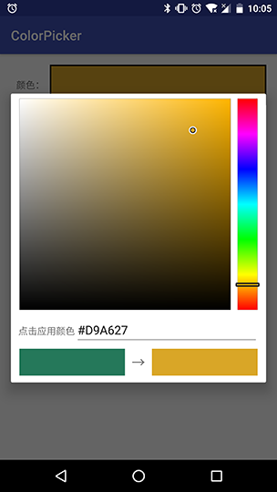

# ColorPicker

作者：王鑫

[TOC]
## 简介


ColorPicker是一个仿PhotoShop取色板的颜色拾取组件。

!

## 引用方法

### 使用gradle加载依赖

#### 1 在project的build.gradle中
```groovy
allprojects {
    repositories {
        ...
        maven { url 'https://jitpack.io' }
    }
}
```

#### 2 在你moudle的build.gradle中
```groovy
compile 'com.github.relish-wang:ColorPicker:0.0.1-SNAPSHOT'
```

### 更新历史

[**CHANGELOG.md**](CHANGELOG.md)

## 使用方法

### 启动选择弹窗
```
new ColorPickerDialog.Builder(MainActivity.this, mColor)   //mColor:初始颜色
        .setHexValueEnabled(mHexValueEnable)               //是否显示颜色值
        .setOnColorChangedListener(onColorChangedListener) //设置监听颜色改变的监听器
        .build()
        .show();//展示
```

## 注意事项

- 要求API Level 15以上


## 混淆配置

无
